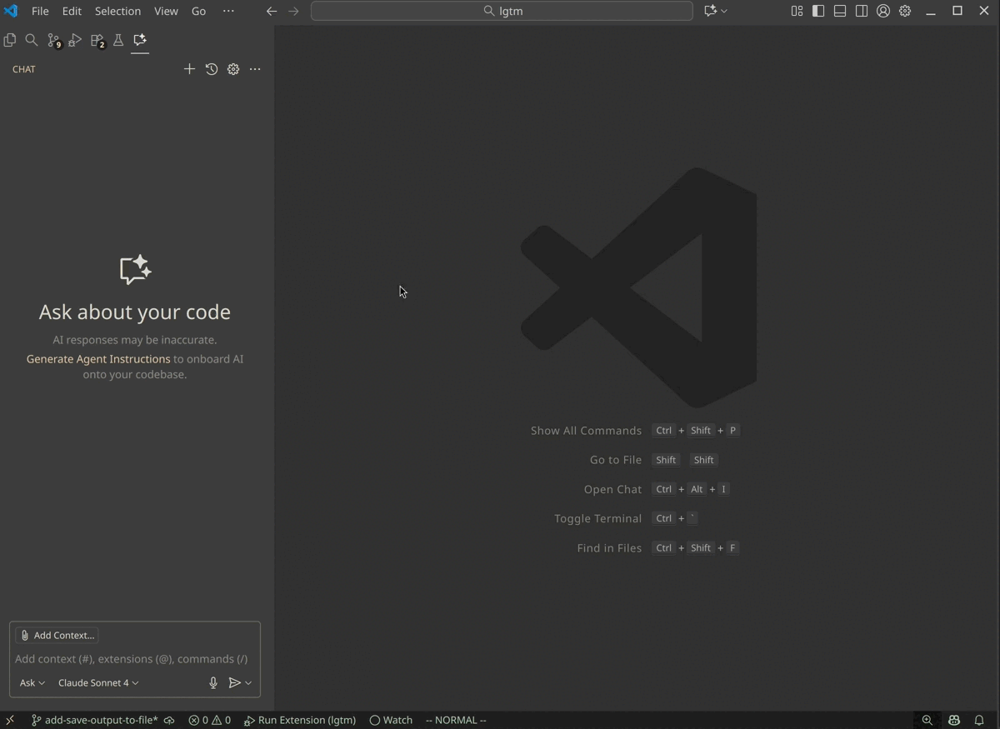

# LGTM

Use GitHub Copilot Chat to review your code.

To start, open Copilot Chat and send one of the following messages:
- `@lgtm /branch` to review changes on a branch (compared to a reference branch)
- `@lgtm /commit` to review changes in a commit

You'll receive review comments grouped by file after selecting the desired commit or branches in the quick select.

## Features
- Uses the GPT-4o version of Copilot Chat, no separate subscription or API key required.
- Review content remains in chat history, so you can ask follow-up questions to Copilot (without `@lgtm`).

## Limitations
- Due to a small 4000 token context window, LGTM may lack some information on how your changes work together. At the moment, most comments will point out local bugs or typos rather than architecture-level comments looking at how multiple files work together.
- Since this project is still work in progress, quality of comments may be mixed. This should improve in future versions.
- For now, only Copilot's language model can be used via the `vscode.lm` API.

## Data Usage
Source code checked into Git and selected for review will be sent to GitHub Copilot. Avoid using it on repositories where you would not use Copilot.

