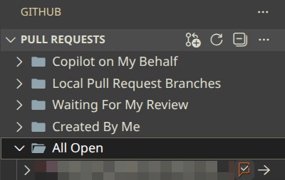
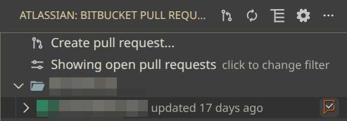

# LGTM - AI Code Review

Use GitHub Copilot Chat to review source code changes in Git, and catch bugs, areas for improvement, and other issues before merging.
Open the command palette and select `LGTM: Start Code Review...` to select what to review.

## Getting Started

After starting a review with `LGTM: Start Code Review...`, LGTM will print review comments grouped by file and sorted by severity in the Chat sidebar.
Click on line numbers to jump to the location (if checked out).

### Reviewing Pull Requests

If you have the [GitHub Pull Requests](https://marketplace.visualstudio.com/items?itemName=GitHub.vscode-pull-request-github) extension installed, you can start a review by hovering over a pull request and clicking the LGTM icon:

If you have the [Atlassian: Jira, Rovo Dev, Bitbucket](https://marketplace.visualstudio.com/items?itemName=Atlassian.atlascode) extension installed, you can also start a review for Bitbucket pull requests directly:

### Starting a Review From Chat

- Type `/review` followed by Return to bring up the same interactive menu as the `LGTM: Start Code Review...` menu command.
- You can specify git refs as arguments, e.g. `/review develop main`, or omit arguments to select refs interactively.

### Use in Agent Mode

LGTM is also available in agent mode, so you can include it as part of your worklflow.
For example, you might ask the agent to `Review the current changes using #reviewStaged and fix any severe issues.`
Assuming you have staged changes, the agent will start a review using LGTM and then act on the review comments. Consider specifying the severity of issues to fix, e.g. `... and fix any issues with severity >= 3.`

## Features

- **Only Copilot Required**: Uses Copilot Chat for reviewing changes. Both free and paid plans are supported.
- **Model Selection**: Choose other language model available to VS Code via the **LGTM: Select Chat Model** command available in the Command Palette (press `Cmd+Shift+P` or `Ctrl+Shift+P`).
- **Custom Instructions**: Add custom instructions via the `Lgtm: Custom Prompt` setting (e.g., change the language of review comments by adding `- In the final JSON output, use Spanish for the `comment` field.`).
- **Pull Request Integration**: Review pull requests from the GitHub Pull Request or Bitbucket extensions.
- **Agent Support**: Adds tools to enable automatic reviews in agent mode:
    - `#review`: Reviews changes between two git references (branches, tags, or commits)
    - `#reviewStaged`: Reviews only staged changes in your working directory
    - `#reviewUnstaged`: Reviews only unstaged changes in your working directory
    - Example usage: `After your changes, run all tests and run #reviewUnstaged to check your work.`
- **Chat Integration**: Review content remains in chat history for follow-up questions by omitting `@lgtm`.
- **Automatic Fixes**: Use the `Fix` action on a review comment to fix it automatically. This will use the language model configured for inline chat.

## Limitations

- Chat models listed under "Unsupported Models" can be selected but reviews will fail at runtime.
- Non-Copilot models (e.g. those added by directly adding an API key) may fail to work. For Claude language models, try the [Claude Model Provider](https://marketplace.visualstudio.com/items?itemName=cpulvermacher.claude-model-provider) extension.
- Large change sets may trigger chat model rate limits. Please wait before retrying.

## Data Usage

Source code changes and commit messages selected for review are sent to the chat model configured in the extension settings (default: GitHub Copilot GPT-4.1).

## Contributing

Contributions are welcome! If you have ideas, bug reports, or want to help improve LGTM, please open an issue or submit a pull request on [GitHub](https://github.com/cpulvermacher/lgtm).
